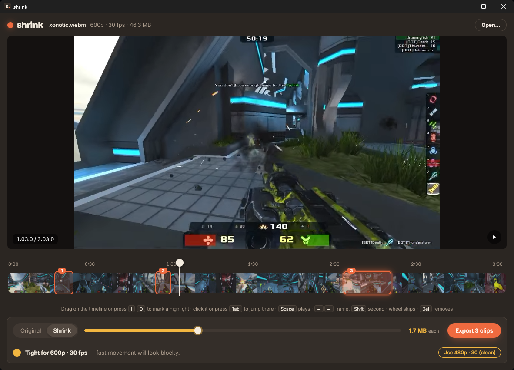

<p align="center"></p>

<h1 align="center">shrink</h1>

A small Windows app for gameplay clips. Mark your highlights, then either

- **save them losslessly**, without re-encoding, in the original quality (for montages), or
- **shrink them to a size you pick**, e.g. 10 MB for Discord, with the best quality shrink can fit.

It uses your graphics card to encode (NVIDIA, AMD or Intel) and falls back to the CPU.



<sub>Screenshot footage: [Xonotic 0.8.2 gameplay](https://commons.wikimedia.org/wiki/File:Xonotic_0-8-2_gameplay.webm) by Drummyfish and the Xonotic developers, GPLv3.</sub>

## Download

Get the installer from the [latest release](https://github.com/asunoaim/shrink/releases/latest). shrink tells you when a new version is out and updates with one click.

Windows may show "Windows protected your PC" because the installer isn't signed with a paid certificate. Click **More info → Run anyway**.

## Using it

1. Drop a clip on the window, or right-click a video → **Show more options → Open in shrink**.
2. Drag across the timeline to mark a highlight, or press **I** (start) and **O** (end). Mark as many as you like; each one becomes its own file.
3. Pick **Original** or **Shrink**, set the size, and press **Export**. The files land in the folder you choose and are copied to the clipboard, so Ctrl+V in Discord just works.
4. **⚙** in the top bar: where clips are saved, clipboard on/off, and what a clip starts with (audio, mode, size).

| Key | Action |
|---|---|
| Space | Play / pause (plays on past the highlight's end) |
| Click a highlight / E | Jump to its start (Q: previous one) |
| Mouse wheel on the timeline | Skip 1 s (Shift: 5 s) |
| ← / → | One frame back / forward |
| Shift + ← / → | One second |
| I / O | Start / end of a highlight |
| Delete | Remove the selected highlight |

## Ideas and bugs

[Open an issue](https://github.com/asunoaim/shrink/issues). Feature requests are welcome.

## Building

Needs Node 20+, Rust (stable, MSVC) and the Visual Studio C++ build tools.

```powershell
npm install
powershell -ExecutionPolicy Bypass -File scripts/fetch-ffmpeg.ps1   # once, downloads the bundled ffmpeg
npm run tauri dev      # run
npm run tauri build    # installer in src-tauri/target/release/bundle/nsis/
```

Tests: `npm test` (screen logic) and `cargo test --manifest-path src-tauri/Cargo.toml` (engine; needs ffmpeg on the PATH or installed via WinGet).

Releases are published with `pwsh -File scripts/release.ps1` (needs the updater signing key).

## License

GPL-3.0-or-later.

shrink ships [FFmpeg](https://ffmpeg.org), using the GPL "essentials" build from [gyan.dev](https://www.gyan.dev/ffmpeg/builds/). Its license is installed as `ffmpeg/LICENSE-ffmpeg.txt`. Every release includes the matching FFmpeg source code and the list of libraries in that build. For the source of any other bundled component, open an issue and it will be provided.
